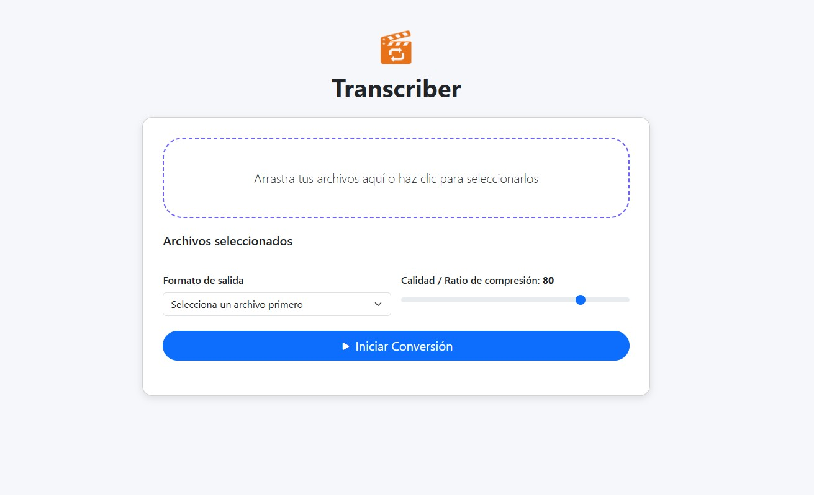

# Transcriber – Conversor multimedia por lotes

Transcriber es una herramienta web (SPA) que convierte lotes de vídeo, audio e imagen entre los formatos más habituales sin bloquear la interfaz gráfica.  
Su núcleo está escrito en **Python 3 + Flask** y delega la codificación a **FFmpeg**; el front-end es una aplicación de página única (HTML + Vanilla JS + Bootstrap 5).

---

---

## 🚀 Motivación y decisiones de diseño

| Requisito | Decisión | Ventajas |
|-----------|----------|----------|
| Conversión multi-formato, con control de calidad | **FFmpeg** a través de la librería *ffmpeg-python* | Soporta prácticamente cualquier códec / contenedor y permite un mapeo expresivo de parámetros. |
| Operaciones en 2.º plano | `concurrent.futures.ThreadPoolExecutor` con tantos workers como CPUs disponibles | La UI nunca se bloquea y el rendimiento escala al hardware. |
| Interfaz moderna y UX fluida | **SPA** + Bootstrap 5 + Fetch API + miniaturas en vivo | Feedback inmediato, arrastrar/soltar y vistas previas automáticas. |
| Portabilidad | **Python 3.10+** y dependencias mínimas del sistema (Ubuntu LTS) | Fácil de desplegar en servidores comunes o contenedores. |
| Conversión por perfiles | Deslizador *Quality Level* 1-100 → parámetros CRF/bitrate en `logic.py` | Unifica la experiencia para vídeo, audio e imágenes. |
Privacidad | Procesamiento 100 % local con FFmpeg en la propia máquina/servidor | Ningún archivo sale de tu red; no se cargan metadatos en servicios externos; cumplimiento sencillo de GDPR. 

## 🏗️ Arquitectura

SPA (HTML/JS) ───── fetch /convert ─────┐

│

Flask (WSGI) ➜ ThreadPool ➜ convert_file() ➜ FFmpeg

│

SPA ← poll /task_status <id> ←─────────┘

- **Front-end** (static/)  
  HTML5, Bootstrap 5, íconos de *bootstrap-icons* y un único `app.js` que:
  1. Gestiona la lista de archivos,
  2. Lanza la petición `/convert`,
  3. Hace *polling* al estado y muestra miniaturas o reproductores nativos.

- **Back-end** (`app.py`)  
  API REST en Flask. Cada archivo se encola en un *future*, aprovechando al máximo las capacidades del host.

- **Conversión** (`logic.py`)  
  Genera dinámicamente la línea de comandos de FFmpeg (o `heif-convert` para HEIC) y limpia los temporales.

## 💡 Lecciones aprendidas

1. **HEIF/HEIC**: Muchos navegadores no soportan vistas previas; se añadió un paso a PNG usando `heif-convert` antes de invocar FFmpeg.  
2. **Seguridad**: Se validan *MIME* y extensión antes de ejecutar FFmpeg para evitar inyección de parámetros.  
3. **Escalabilidad**: Stateless; puede crecer horizontalmente detrás de Nginx con un almacén compartido (por ejemplo, el servicio S3 de AWS).

## ✍️ Experiencia personal
El planteamiento inicial del proyecto fue desarrollarlo completamente en C++, buscando la máxima eficiencia y control sobre los procesos de conversión multimedia. Sin embargo, pronto surgieron varias limitaciones importantes:

- Escasez de frameworks fiables para construir APIs REST: En C/C++, la mayoría de soluciones para exponer una API web son muy básicas o requieren una infraestructura compleja, lo que dificulta construir una interfaz moderna y mantenible.

- Integración poco amigable con FFmpeg: Aunque FFmpeg está escrito en C, la utilización directa de su API resulta poco práctica para aplicaciones web modernas, y su integración con frameworks de C es limitada, especialmente cuando se requieren operaciones asincrónicas y procesamiento en segundo plano.

- Desarrollo y mantenimiento: El desarrollo en C para este tipo de aplicación implica mayor carga de trabajo, especialmente en la gestión de memoria y concurrencia, lo que ralentiza la iteración y aumenta la probabilidad de errores difíciles de depurar.